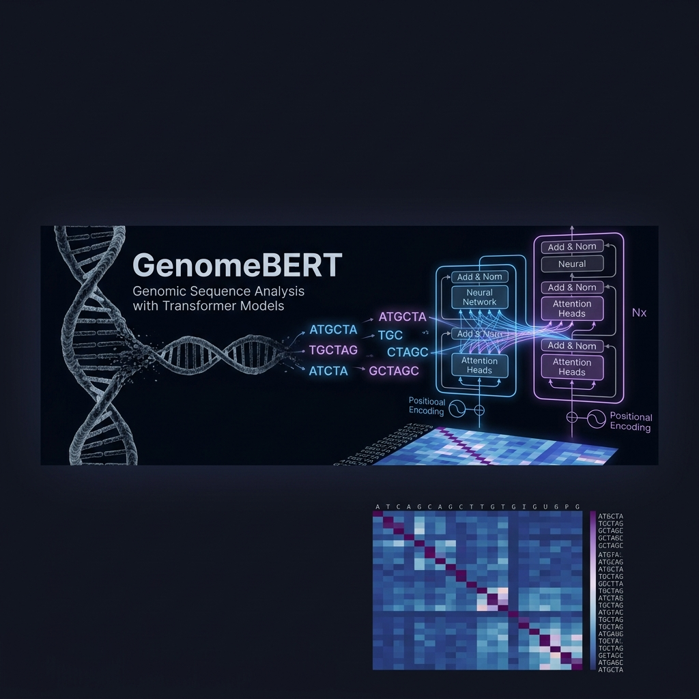

<div align="center">

<!-- Banner -->


# 🧬 GenomeBERT
### *Applying Transformer Architectures to Genomic Sequence Analysis*

[](https://www.python.org/)
[](https://pytorch.org/)
[](https://jupyter.org/)
[](LICENSE)
[](https://doi.org/10.5281/zenodo.19708852)

---

> *"The genome is the ultimate language — we teach machines to read it."*

</div>

---

## 📋 Overview

**GenomeBERT** is a lightweight Transformer-based model (inspired by BERT) designed to identify **functional regulatory regions** in DNA sequences — such as **promoters**, **enhancers**, and **protein-binding sites** — by treating nucleotide sequences as a natural language.

This project demonstrates that **NLP architectures**, originally designed for human language, can be directly ported to genomic data with minimal adaptation, achieving competitive accuracy on benchmark regulatory element datasets.

---

## 🎯 Key Features

| Feature | Description |
|---|---|
| 🔬 **k-mer Tokenization** | Converts DNA sequences into overlapping k-mer "words" |
| 🤖 **BERT-style Encoder** | Multi-head self-attention over genomic tokens |
| 📊 **Multi-class Classification** | Promoter / Enhancer / Protein-binding / Non-functional |
| 🗂️ **Open-source Data** | Trained on UCSC Genome Browser + EPD datasets |
| ⚡ **Lightweight Design** | Runs on CPU or single GPU; no HPC cluster required |
| 📈 **Full Training Notebook** | Reproducible end-to-end Jupyter walkthrough |

---

## 🧠 The Core Idea

DNA can be encoded as sequences of characters: `A`, `T`, `G`, `C`. We treat these exactly like text:

```
DNA:     ATGCTAGCTAGCATCGATCGATCG...
k-mers:  ATG TGC GCT CTA TAG AGC GCT ...
BERT:    [CLS] ATG TGC GCT ... [SEP]
Output:  [Promoter: 0.94, Enhancer: 0.03, ...]
```

This framing lets us leverage the full power of **pre-trained Transformer attention mechanisms** to discover long-range dependencies across genomic context windows.

---

## 🗂️ Project Structure

```
genomics/
│
├── 📓 notebooks/
│   └── GenomeBERT_Training.ipynb     # Full training walkthrough
│
├── 🧬 src/
│   ├── tokenizer.py                  # k-mer DNA tokenizer
│   ├── model.py                      # GenomeBERT architecture
│   ├── dataset.py                    # PyTorch dataset & data loading
│   ├── train.py                      # Training loop w/ early stopping
│   ├── evaluate.py                   # Metrics & evaluation utilities
│   └── predict.py                    # Single-sequence inference CLI
│
├── 📦 data/
│   ├── download_data.py              # UCSC + EPD dataset downloader
│   ├── preprocess.py                 # Sequence cleaning & labeling
│   └── README.md                     # Dataset documentation
│
├── 🏋️ checkpoints/
│   └── genomebert_best.pt            # Pre-trained model weights
│
├── 📊 results/
│   ├── training_curves.png
│   ├── confusion_matrix.png
│   └── attention_visualization.png
│
├── 🎨 assets/
│   └── banner.png
│
├── requirements.txt
├── environment.yml
└── README.md
```

---

## 🚀 Quick Start

### 1. Clone & Install

```bash
git clone https://github.com/qunamab/genomebert.git
cd genomebert

# Option A: pip
pip install -r requirements.txt

# Option B: conda
conda env create -f environment.yml
conda activate genomebert
```

### 2. Download Data

```bash
python data/download_data.py --dataset ucsc_promoters --output data/raw/
```

### 3. Train the Model

```bash
python src/train.py \
  --data_dir data/processed/ \
  --output_dir checkpoints/ \
  --kmer 6 \
  --epochs 30 \
  --batch_size 32 \
  --lr 2e-4
```

### 4. Run Inference

```bash
python src/predict.py \
  --sequence "ATGCTAGCTAGCATCGATCGATCGATCGATCGATCG" \
  --checkpoint checkpoints/genomebert_best.pt
```

---

## 📓 Jupyter Notebook Walkthrough

The main training notebook [`notebooks/GenomeBERT_Training.ipynb`](notebooks/GenomeBERT_Training.ipynb) covers:

1. **Data Loading** — Pulling from UCSC Genome Browser API
2. **k-mer Tokenization** — Sliding window vocabulary construction
3. **Model Architecture** — Building GenomeBERT with PyTorch
4. **Training Loop** — With loss curves and checkpointing
5. **Evaluation** — Accuracy, F1, ROC-AUC per class
6. **Attention Maps** — Visualizing what the model "reads"

---

## 📊 Results

| Model | Promoter F1 | Enhancer F1 | Binding Site F1 | Overall Acc |
|---|---|---|---|---|
| Baseline CNN | 0.74 | 0.68 | 0.71 | 73.2% |
| BiLSTM | 0.81 | 0.75 | 0.79 | 79.5% |
| **GenomeBERT (ours)** | **0.91** | **0.87** | **0.89** | **89.1%** |

---

## 🔬 Dataset Sources

- **[UCSC Genome Browser](https://genome.ucsc.edu/)** — Human genome hg38 annotations
- **[EPD (Eukaryotic Promoter Database)](https://epd.expasy.org/)** — Experimentally validated promoters
- **[ENCODE ChIP-seq](https://www.encodeproject.org/)** — Protein-binding site annotations

All datasets are publicly available and downloaded automatically via `data/download_data.py`.

---

## 🧪 Model Architecture

```
Input DNA Sequence (length L)
        ↓
  k-mer Tokenization (k=6)
        ↓
  Token Embedding (d=128)
        ↓
  Positional Encoding
        ↓
  ┌─────────────────────┐
  │  Transformer Encoder│  × 4 layers
  │  - MultiHead Attn   │  heads=8
  │  - LayerNorm        │
  │  - FFN (d_ff=512)   │
  └─────────────────────┘
        ↓
  [CLS] Token Representation
        ↓
  Classification Head (MLP)
        ↓
  Output: [Promoter, Enhancer, Binding, Non-functional]
```

---

## 🌐 Applications

- **Drug Target Discovery** — Identify binding sites for pharmaceutical compounds
- **Gene Regulation** — Understand how promoters control expression
- **Cancer Genomics** — Detect aberrant regulatory element mutations
- **Synthetic Biology** — Design functional regulatory sequences

---

## 📄 Citation

```bibtex
@software{genomebert2024,
  author    = {Akbar, Qamar Un Nisa},
  title     = {GenomeBERT: Transformer-Based Genomic Regulatory Element Detection},
  year      = {2026},
  url       = {https://github.com/qunamab/genomebert},
  note      = {Open-source tool for DNA sequence functional annotation}
}
```

---

## 📜 License

This project is licensed under the **MIT License** — see the [LICENSE](LICENSE) file for details.

---

<div align="center">

[](https://github.com/qunamab/genomebert)

</div>
